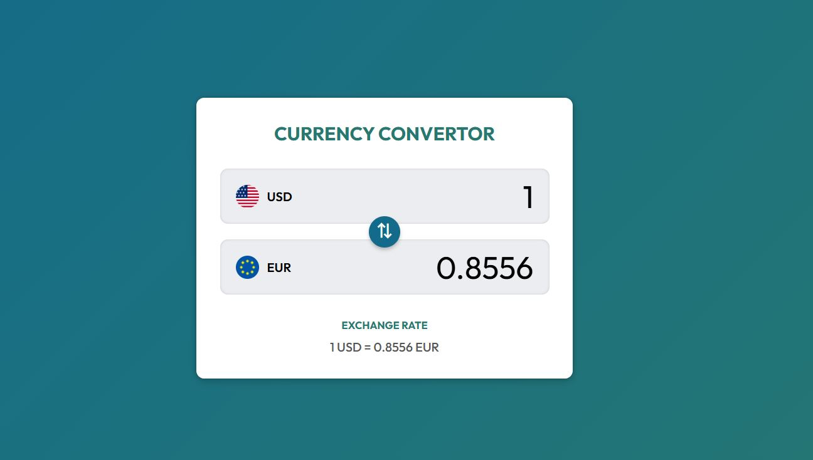

# Currency Convertor

A javascript app providing real-time exchange rate information to help users convert currencies from one value to another.

### Features

- [ ] Toggle drawer to display currencies
- [ ] Display list of available currencies from API
- [ ] Currency search functionality
- [ ] Exclude current selected pairs (base and target currency)
- [ ] Choose currency pairs for conversion
- [ ] Display exchange rate
- [ ] Calculate and display the conversion result
- [ ] Switch conversion pairs with one-click "swap"
- [ ] Show loading indicator on data retrieval

### Requirements

**Freecurrency API Key**

1. Go to [Freecurrency API](https://freecurrencyapi.com)
2. Register and get your own API key

### Resources
- [Freecurrency API](https://freecurrencyapi.com)
- [Google Fonts](https://fonts.google.com)

### Workflow

```
1. Page Load
   ↓
2. initApp()
   → fetchCurrencies() → state.currencies → displayCurrencies()
   → fetchExchangeRate() → state.rates → displayConversion()
   ↓
3. User Action
   ├─ Click Base/Target button → showDrawer() → state.openedDrawer set
   ├─ Type in search box → filteredCurrency() → displayCurrencies()
   ├─ Select currency → selectPair()
   │     └─ Updates state.base/target
   │     └─ loadExchangeRate() → fetchExchangeRate() if needed
   │     └─ displayConversion() → hideDrawer()
   ├─ Enter value in base input → convertInput() → update state.baseValue → displayConversion()
   └─ Click swap button → switchPair() → swap base/target → loadExchangeRate()
   ↓
4. Rendering Cycle (always after state change)
   → updateButtons() (currency labels + flags)
   → updateInputs() (recalculate conversion)
   → updateExchangeRate() (display rate text)
   ↓
5. Updated UI displayed to user
```

### Screenshot


